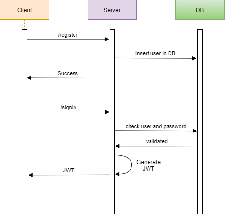

# LoginServer
A login utility that will verify users to further access contents of a website or a service at /signin endpoint

[Update]
The MicroService also registers new users at /register endpoint

## API Spec :  
1.  Signin API  
    Endpoint : /signin  
    Method : POST  
    Request Payload : `{"userid": "username","password": "pass@123"}`  
    Response : `{"token": <tokenString>}`

2.  Resgister API
    Endpoint : /register  
    Method : POST  
    Request Payload : `{"userid": "username","password": "pass@123"}`  
    Response : HTTP response code
    
3.  Validate API  
    Endpoint : /validateToken  
    Method : POST  
    Request Payload : `Header : {"Authorization": "Bearer <token>"}`  

## Sequence Diagram  

